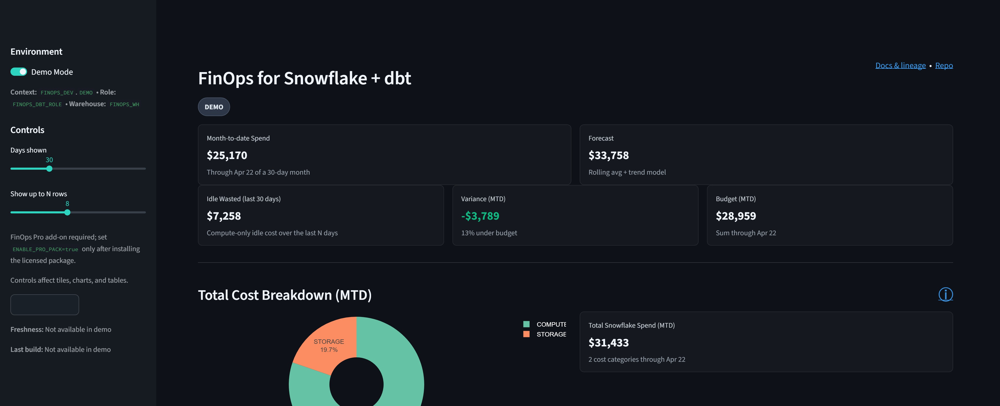
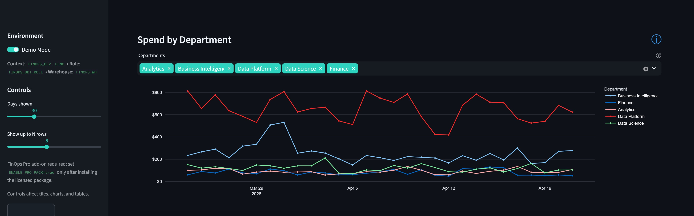
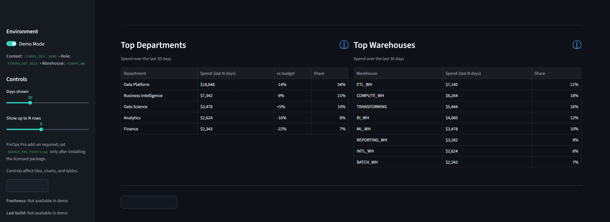
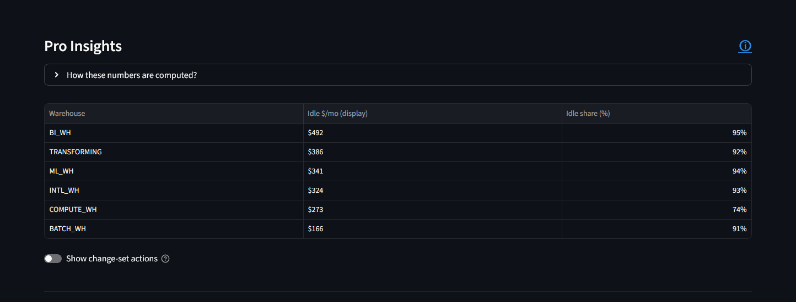
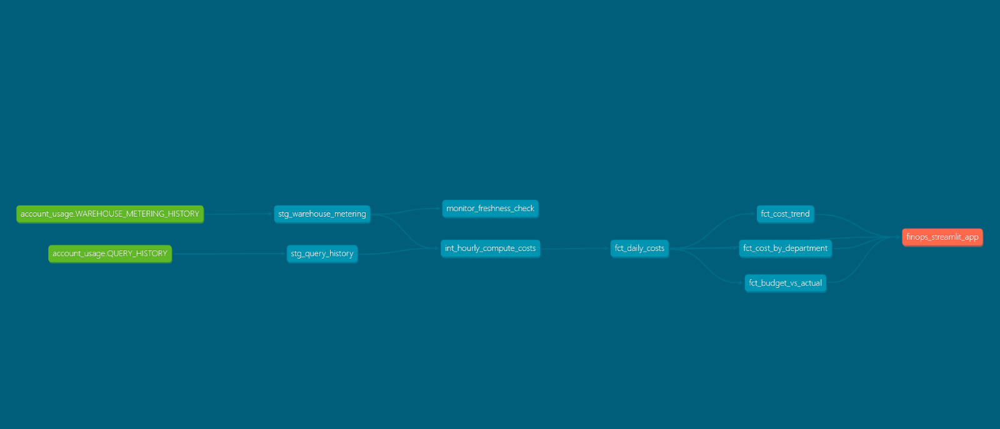
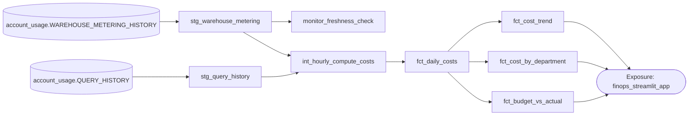

# FinOps for Snowflake + dbt (Starter v1.4.0)

A production-literate starter that turns Snowflake `ACCOUNT_USAGE` into clear daily $$, KPIs, lineage, and a small Streamlit app. Optional **Pro** add-on surfaces hourly idle patterns and right-sizing hints.

<p align="center">
  <a href="https://mcgrath-dylan.github.io/finops-dbt/">
    
  </a>
  <a href="https://github.com/mcgrath-dylan/finops-dbt">
    
  </a>
</p>

<p align="center">
  
</p>


## Quickstart — 30s

```bash
git clone https://github.com/mcgrath-dylan/finops-dbt.git
cd finops-dbt
cp .env.example .env                       # configure dbt/Streamlit variables
python -m venv .venv && source .venv/bin/activate   # or your preferred env
pip install -r requirements.txt
dbt deps && dbt build --vars '{"enable_pro_pack": false, "DEMO_MODE": true}' --fail-fast
streamlit run app/streamlit_app.py
````

### Quickstart (.env)

| Mode | What to set in `.env` | Notes |
| ---- | --------------------- | ----- |
| Demo walkthrough | Leave Snowflake creds blank, keep `DBT_TARGET=demo`, `DEMO_MODE=true`, `ENABLE_PRO_PACK=false` | Uses the seeded DEMO schema overlay; Pro tiles stay hidden. |
| Live account (Starter) | Provide Snowflake credentials, set `DBT_TARGET=live`, `DEMO_MODE=false`, leave `ENABLE_PRO_PACK=false` | Runs Starter marts against your Snowflake account with live freshness checks. |
| Live account + FinOps Pro add-on | After installing the licensed FinOps Pro package, set `ENABLE_PRO_PACK=true` (keep other live settings) | Pro tiles require the separate FinOps Pro repo; without it the toggle has no effect. |

> Starter ships without the FinOps Pro package. Reach out via the contact in the footer to license the add-on before enabling the Pro flag.

Each pull request now attaches a `dbt-docs.tar.gz` artifact containing `manifest.json`, `catalog.json`, and `index.html` (plus compiled SQL when available) so reviewers can unzip locally and open `index.html` without hitting Snowflake.

## Highlights (1-minute skim)

* **Authoritative daily spend** from `WAREHOUSE_METERING_HISTORY` with tested marts & contracts.
* **Docs & lineage** auto-published to GitHub Pages (Base; Pro when enabled).
* **Streamlit app**: MTD, forecast, dept trend; **Pro** adds idle \$/mo and idle share %.
* **CI discipline**: PR compiles & docs artifacts; `main` publishes; nightly refresh \~midnight ET.

## Starter vs Pro

| Capability                                        | Starter | Pro |
| ------------------------------------------------- | :-----: | :-: |
| Month-to-date (authoritative)                     |    ✅    |  ✅  |
| Forecast (month)                                  |    ✅    |  ✅  |
| Idle wasted (last N days, display)                |    ✅    |  ✅  |
| Idle projected (monthly, from hourly)             |         |  ✅  |
| Pro insights table (idle \$/mo, idle %)           |         |  ✅  |
| Change-set actions (autosuspend/right-size hints) |         |  ✅  |

## Screens

<p>
  <br/>
  <br/>
  
</p>

## Architecture & lineage

> The docs include interactive lineage. For quick context in the README, here’s a static capture.

<p align="center">
  <a href="app/screenshots/lineage.png">
    
  </a>
</p>

<details>
<summary>Optional: schematic (Mermaid fallback)</summary>



</details>

---

<details>
<summary><b>What you get (more detail)</b></summary>

**Starter**

* Month-to-date spend (authoritative), Forecast (month), Idle (last N days, display)
* Spend by Department (trend), Top Departments/Warehouses
* Seeds for demo budgets & dept mapping
* Live docs & lineage on GitHub Pages (**Base**)

**Pro (optional, licensed)**

* Idle projected (monthly) from hourly model
* Pro insights table: idle \$/mo (display) and idle share %
* Optional change-set actions (autosuspend / right-size hints)

</details>

<details>
<summary><b>How the numbers are computed</b></summary>

* **Authoritative daily spend**: credits from `WAREHOUSE_METERING_HISTORY` at daily grain (`fct_daily_costs`).
* **Forecast (month)**: current pace projected to a 30-day month.
* **Idle (last N days)**: historical sum of idle-classified hours over the window (display).
* **Pro idle projected (monthly)**: scales Pro hourly model to a month.
* **Pro idle share %**: idle hours / total active hours in the Pro hourly model.

> Pro heuristics are conservative hints, not a policy engine.

</details>

<details>
<summary><b>Runbook & CI</b></summary>

* **PRs**: compile + docs as artifacts (no publish).
* **Main**: publish **Base** docs always; publish **Pro** docs when a token is present.
* **Nightly**: \~midnight ET (05:00 UTC).
* **Docs default**: built **without** live Snowflake creds (stable, reproducible).

  * If you want **live catalog metadata**, uncomment `SNOWFLAKE_*` in `.github/workflows/docs.yml` and add a build step before `dbt docs generate`.

</details>

## License / Documentation / Contact

Starter: **Apache-2.0**  
Pro add-on: **Business Source License 1.1** (in private repo)

**View Documentation:
[Starter Version](https://mcgrath-dylan.github.io/finops-dbt/base/) • [Pro Version](https://mcgrath-dylan.github.io/finops-dbt/pro/)**  

> Interested in a guided walk-through or a customized build for your environment?  
> I would be happy to tailor the app to your needs.

**Questions, feedback, or Pro licensing: mcgrath.fintech@gmail.com**
