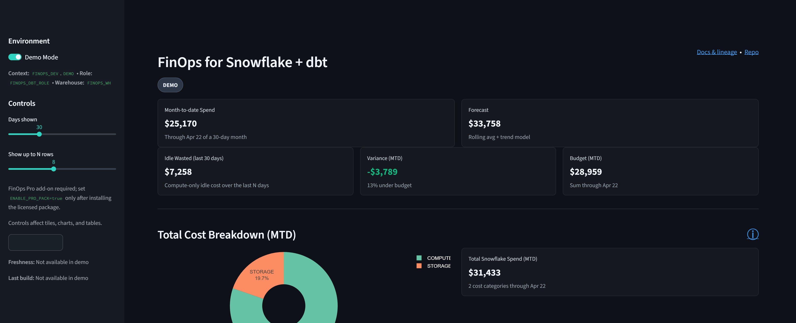
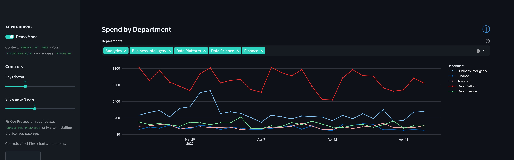
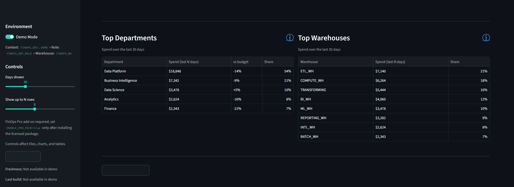
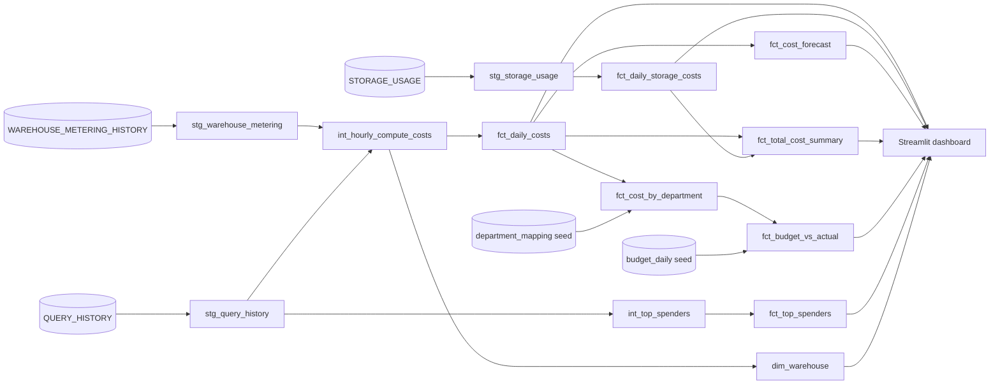

# Snowflake FinOps Starter

Snowflake bills are hard to explain when compute, storage, forecasts, and department budgets live in separate places. This dbt project turns `SNOWFLAKE.ACCOUNT_USAGE` into tested cost marts and a Streamlit dashboard so analytics teams can see what changed, who is driving usage, and where the month is likely to land.

[](https://github.com/mcgrath-dylan/finops-dbt/actions/workflows/ci.yml)
[](https://github.com/mcgrath-dylan/finops-dbt/actions/workflows/nightly.yml)


Documentation: [mcgrath-dylan.github.io/finops-dbt/base/](https://mcgrath-dylan.github.io/finops-dbt/base/)

## Screenshots

<p>
  <br>
  <br>
  
</p>

## Quickstart

1. Clone the repo and create an environment.

```bash
git clone https://github.com/mcgrath-dylan/finops-dbt.git
cd finops-dbt
python -m venv .venv
source .venv/bin/activate
pip install -r requirements.txt
```

2. Configure Snowflake environment variables.

The demo path uses seeded Account Usage overlays, but dbt still needs a Snowflake warehouse to build those seeds and models. Run `scripts/bootstrap_snowflake.sql` once in a fresh account, then export the seven connection values in your shell. `.env` is also read by the Streamlit app.

```bash
export SNOWFLAKE_ACCOUNT="<account_identifier>"
export SNOWFLAKE_USER="<dbt_user>"
export SNOWFLAKE_PASSWORD="<password>"
export SNOWFLAKE_ROLE="FINOPS_DBT_ROLE"
export SNOWFLAKE_WAREHOUSE="FINOPS_WH"
export SNOWFLAKE_DATABASE="FINOPS_DEV"
export SNOWFLAKE_SCHEMA="ANALYTICS"
```

3. Install dbt package dependencies.

```bash
dbt deps --profiles-dir .ci/profiles --target demo
```

4. Run the demo build with seeded data.

```bash
dbt seed --profiles-dir .ci/profiles --target demo
dbt build --profiles-dir .ci/profiles --target demo --vars '{"DEMO_MODE": true, "enable_pro_pack": false}'
```

5. Launch the dashboard.

```bash
streamlit run app/streamlit_app.py
```

For live Account Usage, switch `DEMO_MODE` off after the fresh account has usage history.

```bash
dbt compile --profiles-dir .ci/profiles --target dev
dbt build --profiles-dir .ci/profiles --target dev --vars '{"DEMO_MODE": false, "enable_pro_pack": false}'
```

`make demo` runs the demo path with the committed profile:

```bash
make demo
```

## Features

| Capability | Starter | Pro add-on |
| --- | :---: | :---: |
| Daily compute spend from `WAREHOUSE_METERING_HISTORY` | Yes | Yes |
| Daily storage spend from `STORAGE_USAGE` | Yes | Yes |
| Department showback and budget variance | Yes | Yes |
| 30-day warehouse cost forecast | Yes | Yes |
| Compute + storage total cost summary | Yes | Yes |
| Top spenders by user and query volume | Yes | Yes |
| Warehouse metadata dimension | Yes | Yes |
| Query-level cost attribution |  | Yes |
| Warehouse optimization recommendations |  | Yes |
| Auto-clustering cost signals |  | Yes |

Starter is Apache-2.0. The Pro add-on is licensed separately and is not required for this project to build.

## Architecture


```mermaid
flowchart LR
  WMH[(WAREHOUSE_METERING_HISTORY)]
  QH[(QUERY_HISTORY)]
  SU[(STORAGE_USAGE)]
  BUD[(budget_daily seed)]
  MAP[(department_mapping seed)]

  WMH --> SWM[stg_warehouse_metering]
  QH --> SQH[stg_query_history]
  SU --> SSU[stg_storage_usage]

  SWM --> IHC[int_hourly_compute_costs]
  SQH --> IHC
  IHC --> FDC[fct_daily_costs]
  SSU --> FDS[fct_daily_storage_costs]
  FDC --> FCF[fct_cost_forecast]
  FDC --> FCD[fct_cost_by_department]
  MAP --> FCD
  FCD --> FBV[fct_budget_vs_actual]
  BUD --> FBV
  FDC --> FTS[fct_total_cost_summary]
  FDS --> FTS
  SQH --> ITS[int_top_spenders]
  ITS --> FTOP[fct_top_spenders]

  FDC --> APP[Streamlit dashboard]
  FDS --> APP
  FCF --> APP
  FTS --> APP
  FBV --> APP
  FTOP --> APP
  IHC --> DW[dim_warehouse]
  DW --> APP
```

## Fresh Snowflake Setup

Fresh trial accounts have sparse `ACCOUNT_USAGE` data. The demo seed path is the day-0 validation path for v3.0.0. Live validation should run after Snowflake has populated usage views:

| View | Typical latency |
| --- | --- |
| `METERING_HISTORY` / `QUERY_HISTORY` | Up to 45 minutes |
| `WAREHOUSE_METERING_HISTORY` | Up to 3 hours |
| `STORAGE_USAGE` | Daily refresh |

Run `scripts/generate_demo_workload.sql` 2-3 times over several days before treating live `ACCOUNT_USAGE` row counts as representative.

## Local Commands

| Command | Purpose |
| --- | --- |
| `make demo` | Install packages, seed demo data, build models, launch Streamlit |
| `make live` | Install packages and build against the `live` target |
| `make docs` | Generate and serve dbt docs locally |
| `dbt parse --profiles-dir .ci/profiles --target demo` | Offline project validation |
| `dbt test --profiles-dir .ci/profiles --target demo --vars '{"DEMO_MODE": true}'` | Demo test suite |

## Model Docs

Published dbt docs include model descriptions, column tests, and lineage:

- Starter docs: [base docs](https://mcgrath-dylan.github.io/finops-dbt/base/)
- GitHub Pages root: [finops-dbt docs](https://mcgrath-dylan.github.io/finops-dbt/)

## License

Apache-2.0. See [LICENSE](LICENSE).

Questions or implementation help: mcgrath.fintech@gmail.com
