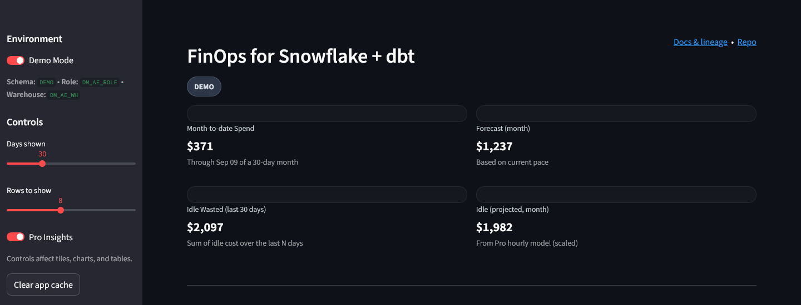
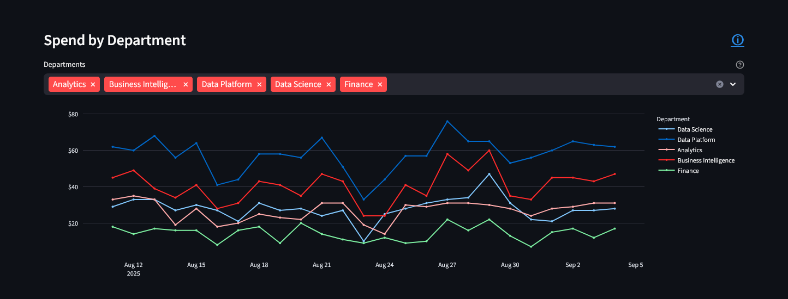
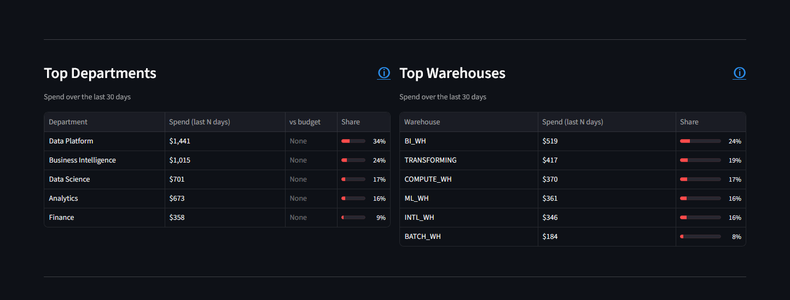

# FinOps for Snowflake + dbt (Starter v1.0.0)

A compact, credible **Snowflake spend** view built with **dbt Core** (Snowflake adapter) and a lightweight **Streamlit** app.  
**Starter** is public; an optional private **Pro** add-on unlocks deeper idle modeling and warehouse-level opportunities.

---

## What you get

**Starter (this repo)**

- **Month-to-date spend** — authoritative, from `SNOWFLAKE.ACCOUNT_USAGE.WAREHOUSE_METERING_HISTORY`
- **Forecast (month)** — prorates the current run rate to a 30-day month
- **Idle wasted (last N days)** — historical sum of hourly idle cost over the last **N** days
- **Spend by Department** (trend)
- **Top Departments** and **Top Warehouses** (last N days)
- **Download insights CSV** (department/warehouse + spend last N + idle $/mo + suggested action)

**Pro (optional, licensed)**

- **Idle projected (monthly)** KPI (from the hourly model, scaled)
- **Pro Insights** table: per-warehouse **Idle $/mo (display)** and **Idle share %**
- **Change-set actions** toggle: suggest autosuspend updates and simple rightsizing hints

> All $ values are estimates except the “authoritative” spend derived from **Warehouse Metering History** (Compute + Cloud Services).

---

## Screenshots

> Images below show **Demo mode** with **Pro enabled** (for illustration). Numbers are sample data.

---

## Architecture at a glance

- **Warehouse sources**: `SNOWFLAKE.ACCOUNT_USAGE` (metering/events).  
- **dbt**: staging → intermediates → marts; tests and docs generated in CI.  
- **App**: Streamlit reads the marts, renders KPIs/tables, and exports an insights CSV.  
- **CI/Docs**: Nightly `dbt build` + GitHub Pages for dbt docs (public).

---

## Starter vs Pro

| Capability | Starter | Pro |
|---|:--:|:--:|
| Month-to-date spend (authoritative) | ✅ | ✅ |
| Forecast (month) | ✅ | ✅ |
| **Idle wasted (last N days)** | ✅ | ✅ |
| **Idle projected (monthly)** |  | ✅ |
| Pro Insights table (Idle $/mo, Idle %) |  | ✅ |
| Change-set actions (autosuspend SQL, hints) |  | ✅ |

---

## Docs & contact

- dbt docs / lineage: published via GitHub Pages.  
- Questions, feedback, or Pro licensing: **mcgrath.fintech@gmail.com**

> Interested in a guided walk-through or a customized build for your environment? Reach out! I would be happy to tailor the app to your needs.
